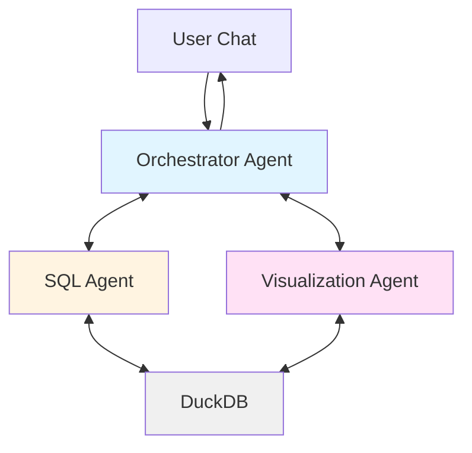

# NBA Analytics Agent

A deployment-ready AI analytics platform demonstrating multi-agent orchestration for natural language data queries. This system enables business users to interact with complex NBA datasets using conversational English, automatically translating questions into optimized SQL queries with transparent execution paths.

[](LICENSE)
[](https://www.python.org/)
[](https://fastapi.tiangolo.com/)
[](https://nextjs.org/)
[](https://www.typescriptlang.org/)

## Overview

This application showcases a modern approach to data analytics through a **hierarchical multi-agent architecture** built with PydanticAI. The system implements specialized AI agents that collaborate to transform natural language queries into actionable database insights.

### Key Features

- **Multi-agent orchestration** with specialized routing and intent classification
- **Natural language to SQL** with automatic query generation and error recovery
- **Chart visualizations** powered by Plotly for query results
- **Query transparency** showing generated SQL and execution metadata
- **Agent observability** with Langfuse tracing for monitoring LLM calls

## Use Cases

**Data Exploration**
- Interactive schema discovery
- Rapid hypothesis testing
- Pattern recognition in game statistics

**Decision Support**
- ML prediction interpretation: LLMs are able to access results of machine learning models
- Scenario analysis with what-if queries
- Performance metric calculation
- "Compare the Raptors and Celtics offensive performance"
- "What are the ML predictions for upcoming games?"

## Tech Stack

- **[FastAPI](https://fastapi.tiangolo.com/)** - Modern async web framework
- **[PydanticAI](https://ai.pydantic.dev/)** - Type-safe AI agent framework
- **[Claude](https://www.anthropic.com/claude)** - Anthropic LLM for agent intelligence
- **[DuckDB](https://duckdb.org/)** - High-performance analytical database
- **[Plotly](https://plotly.com/javascript/)** - Interactive data visualization
- **[Langfuse](https://langfuse.com/)** - LLM observability and tracing
- **[nginx](https://nginx.org/)** - Reverse proxy for unified service routing


## Architecture

### Infrastructure Layer


### Agent System

Hierarchical multi-agent system: the orchestrator chats with the user, and coordinates data analysis and charts from the sub agents:



## Getting Started

### Prerequisites

- Docker and Docker Compose
- Anthropic API key or OpenAI API key

### Running the Application

1. **Clone and navigate**
   ```bash
   git clone <your-repo-url>
   cd analysis-agent-mvp2
   ```

2. **Configure environment**

   Create `backend/.env`:
   ```bash
   ANTHROPIC_API_KEY=your_api_key_here

   # Optional: Enable Langfuse observability
   LANGFUSE_PUBLIC_KEY=your_public_key
   LANGFUSE_SECRET_KEY=your_secret_key
   LANGFUSE_HOST=http://localhost:8081
   ```

3. **Launch**
   ```bash
   docker compose up --build
   ```

4. **Access**
   - Application: [http://localhost:8080](http://localhost:8080)
   - API Docs: [http://localhost:8080/api/v1/docs](http://localhost:8080/api/v1/docs)
   - Langfuse Dashboard: [http://localhost:8081](http://localhost:8081) (if configured)

   The application uses nginx as a reverse proxy that routes:
   - `/api/*` requests to the FastAPI backend
   - All other requests to the Next.js frontend

## Project Structure

```
.
├── backend/                 # FastAPI backend
│   ├── app/
│   │   ├── agents/         # PydanticAI agent implementations
│   │   │   ├── orchestrator.py   # Main routing agent
│   │   │   ├── sql_agent.py      # SQL generation agent
│   │   │   └── tools.py          # Shared agent tools
│   │   ├── api/            # FastAPI routes
│   │   ├── database/       # DuckDB client
│   │   ├── schemas/        # Pydantic models
│   │   └── utils/          # Prompts and helpers
│   └── tests/              # Pytest test suite
├── frontend-nextjs/        # Next.js frontend
│   └── src/
│       ├── app/            # App router pages
│       ├── components/     # React components
│       └── lib/            # API client & types
├── data/                   # DuckDB database files
├── nginx.conf              # Reverse proxy configuration
└── docker-compose.yml      # Container orchestration
```

## Testing

The project includes comprehensive test coverage for core functionality:

```bash
# Execute full test suite
cd backend
pytest -v

# Generate coverage report
pytest --cov=app --cov-report=html tests/

# Run specific test categories
pytest tests/test_agents.py -v      # Agent functionality
pytest tests/test_api.py -v         # API endpoints
```

## Contributing

Contributions are welcome. Please submit pull requests with:
- Clear description of changes
- Updated tests for new functionality
- Documentation updates as needed

For major changes, please open an issue first to discuss the proposed modifications.
